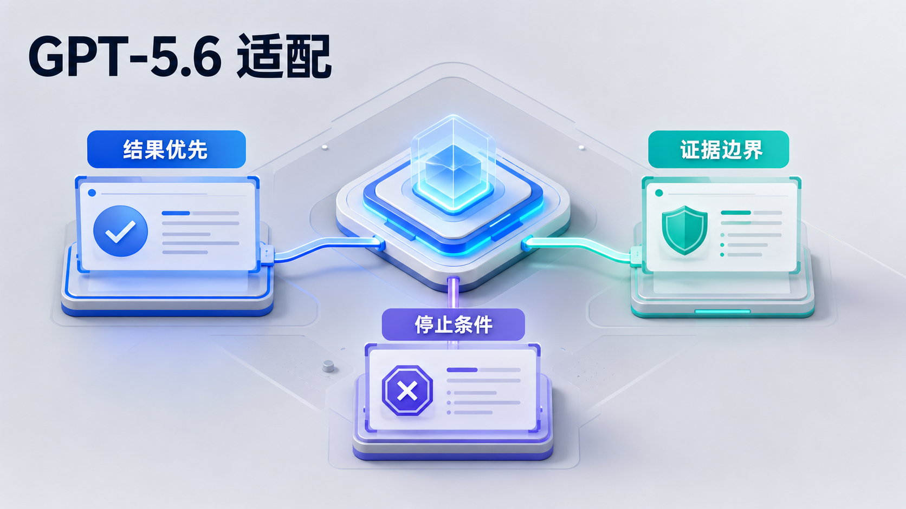

# Codex Agent 规则包


这是一套可以交给 Codex 安装的 Agent 规则包，用来把全局规则、项目规则、经验沉淀和版本发布串成可验证的工作流。

它用于建立三层协作规则：

```text
全局 Agent
        ↓
父级项目 Agent（可选）
        ↓
子项目 Agent 模板
```

这份仓库保留了 guofu 当前使用的规则口径。团队或个人使用时，可以把其中的用户名、路径、输出风格和项目集规则替换成自己的版本。

当前推荐安装版本：`v0.2.5`

## 当前版本的设计重点

- 已按 GPT-5.6 的提示词特性做过适配：强调 outcome-first、执行授权、证据边界、停止条件和最小必要上下文。
- 已优化 Superpowers / Skill 的触发逻辑：显式点名必须使用，隐式调用保持克制，不因极弱关联触发重型流程 Skill。
- Skill 与 Superpowers 不扩大用户授权，不绕过沙箱、审批、外部写入、线上变更、推送或 PR 边界。
- 父级目录模板是可选工具，不是默认安装项；普通项目列表目录优先保持干净，只在明确需要父级规则时安装。
- 规则包配套验证脚本、GitHub Release 和 Wiki，方便团队确认当前安装版本与更新内容。

## 1. 为什么需要这套规则包


过去的问题不是缺少规则，而是规则散落在不同项目、不同对话和不同临时文件里。全局规则、项目规则、工具规则和临时偏好容易混在一起，最后变成难以维护的上下文负担。

这套规则包先解决三个问题：

- 全局规则和项目规则分层。
- 项目模板从一开始就可复制。
- 每次规则变更都能通过脚本验证。


项目推进过程中会不断产生经验、错误、决策和偏好。如果这些内容只留在聊天记录里，就无法稳定服务下一个任务。

这套规则包把经验沉淀拆成两步：

- 先主动识别可沉淀内容。
- 再按授权写入项目 `AGENTS.md`、`.learnings/` 或全局规则。

## 2. 它怎么工作

核心结构是“全局优先、项目叠加、具体规则按需加载”：

- 全局 `AGENTS.md` 负责长期协作方式、授权边界、证据边界、输出风格和通用工具规则。
- 父级项目 `AGENTS.md` 适合管理项目集，例如多个子项目共享同一套结束语、流程或目录规范。
- 子项目模板负责新项目的基础骨架，包括项目级 `AGENTS.md`、`docs/agent/` 和 `.learnings/`。



当前版本已经按 GPT-5.6 的提示词特性做过收敛：

- 结果优先：先明确最终交付和成功标准。
- 证据边界：区分已验证事实、推断和待确认内容。
- 停止条件：证据足够后停止扩展，不把上下文越堆越重。


Superpowers / Skill 的调用也做了边界控制：

- 用户明确点名的 Skill 必须使用。
- 隐式调用只在任务直接匹配且有实际收益时触发。
- Skill 不扩大用户授权，不绕过沙箱、审批、外部写入、线上变更、推送或 PR 边界。
- GitHub Release、Wiki 和验证脚本共同保证团队知道自己安装的是哪个版本。

## 3. 最快使用方式

克隆或下载本仓库后，把整个文件夹交给 Codex，并发送：

```text
请读取这个文件夹里的 README.md 和 Codex Installation Guide.md，按指南帮我安装这套 Agent 规则。
安装前先备份我本机已有的 ~/.codex/AGENTS.md。
安装后请告诉我全局 AGENTS.md、项目级模板和验证结果分别在哪里。
```

当前推荐安装正式 Release 版本：

```bash
git clone --branch v0.2.5 https://github.com/guofu-shiqu/codex-agent-rules.git
```

## 4. 文件结构

```text
README.md
Codex Installation Guide.md
CHANGELOG.md
AGENTS.md
docs/
├── assets/
│   └── readme/
└── wiki/
scripts/
└── verify-agent-rules.sh
tests/
├── README.md
└── cases/
Project and Agent/
├── README.md
├── Parent Project Set/
│   └── AGENTS.md
├── Parent Independent Projects/
│   └── AGENTS.md
└── Child Project Template/
    ├── AGENTS.md
    ├── README.md
    ├── docs/
    │   └── agent/
    │       ├── workflows.md
    │       └── memory-and-decisions.md
    └── .learnings/
        ├── LEARNINGS.md
        └── ERRORS.md
```

## 5. 哪些文件是必要的

必要文件：

- `README.md`：给人和 Codex 的入口说明。
- `Codex Installation Guide.md`：安装步骤。
- `CHANGELOG.md`：规则包更新日志。
- `AGENTS.md`：全局 Agent 规则，安装到 `~/.codex/AGENTS.md`。
- `docs/assets/readme/`：README 可视化配图。
- `docs/wiki/`：GitHub Wiki 页面源文件。GitHub Wiki 未初始化时，可先从这里阅读与同步。
- `scripts/verify-agent-rules.sh`：规则包基础验证脚本。
- `tests/`：规则包测试用例。
- `Project and Agent/README.md`：项目级模板目录的维护说明。
- `Project and Agent/Child Project Template/`：正式新项目模板，安装到 `~/.codex/agent-templates/project-agent/`。
- `Project and Agent/Child Project Template/docs/agent/`：项目级分支规则，随模板复制，按任务命中读取。

可选但保留：

- `Project and Agent/Parent Project Set/AGENTS.md`：父级项目规则。适合“项目集”这类会管理多个子项目的目录；没有父级项目时可以跳过。
- `Project and Agent/Parent Independent Projects/AGENTS.md`：父级独立项目规则样例。仅在明确需要父级目录规则时使用；如果该目录在 Finder 中主要作为项目列表，不建议默认放置父级 `AGENTS.md`。

不包含：

- 不包含过程审查材料。
- 不包含任务触发型文件，例如 `implementation-plan.md`、`decision-log.md`、`final-report.md`，因为这些文件只在具体项目任务命中时创建。
- 不包含软链接，避免多个项目互相污染。

## 6. 安装后的关系

```text
~/.codex/AGENTS.md
        ↓
父级项目/AGENTS.md（可选）
        ↓
具体项目/AGENTS.md
        ↓
具体项目 README / docs / .learnings / 代码与数据
```

## 7. 正式新项目怎么用

创建正式项目时，从这里复制基础模板：

```text
~/.codex/agent-templates/project-agent/
```

复制到新项目根目录后，新项目会有：

```text
AGENTS.md
README.md
docs/agent/workflows.md
docs/agent/memory-and-decisions.md
.learnings/LEARNINGS.md
.learnings/ERRORS.md
```

临时对话、一次性草稿、短期试验目录，不需要创建项目级 `AGENTS.md`。

如果正式项目位于一个长期父级目录下，例如“项目集”或“独立项目”，父级模板是可选增强。只有当你明确希望该父级目录统一管理子项目创建规则时，才把对应父级模板复制为该父级目录的 `AGENTS.md`。

如果父级目录主要用于陈列一个个独立项目，推荐不放父级 `AGENTS.md`，而是在每个正式项目根目录放自己的 `AGENTS.md`。

## 8. 验证规则包

修改全局 Agent、父级目录 Agent、项目级模板或测试用例后，在仓库根目录运行：

```bash
./scripts/verify-agent-rules.sh
```

这会验证：

- 规则包结构完整。
- 项目级主 `AGENTS.md` 能路由到 `docs/agent/`。
- 主动沉淀和暂停沉淀规则存在。
- 新项目模板复制后能形成完整项目级 Agent 骨架。
- 父级“项目集”和“独立项目”模板都能说明自身是可选增强，而不是默认必备文件。
- README 配图、Wiki 源文件和 Release 版本文本存在。

## 9. 版本与 Wiki

- 正式安装版本以 GitHub Releases 为准：<https://github.com/guofu-shiqu/codex-agent-rules/releases>
- 团队阅读文档优先看 GitHub Wiki；如果 GitHub Wiki 尚未初始化，先看仓库内 `docs/wiki/`。
- 每次对外发布安装版本时，应创建 GitHub Release，并同步更新 `CHANGELOG.md` 和 `docs/wiki/Version-History.md`。

## 10. 适合谁使用

适合：

- 已经在用 Codex，并希望长期管理项目上下文的人。
- 需要区分全局规则、父级项目规则、子项目规则的团队。
- 希望新项目一开始就有 `AGENTS.md`、`README.md` 和 `.learnings/` 基础骨架的工作流。

不适合：

- 只做一次性聊天或临时草稿。
- 不希望 Codex 读取本地项目规则。
- 没有持续项目沉淀需求的场景。

## 11. 许可

本仓库使用 MIT License。
